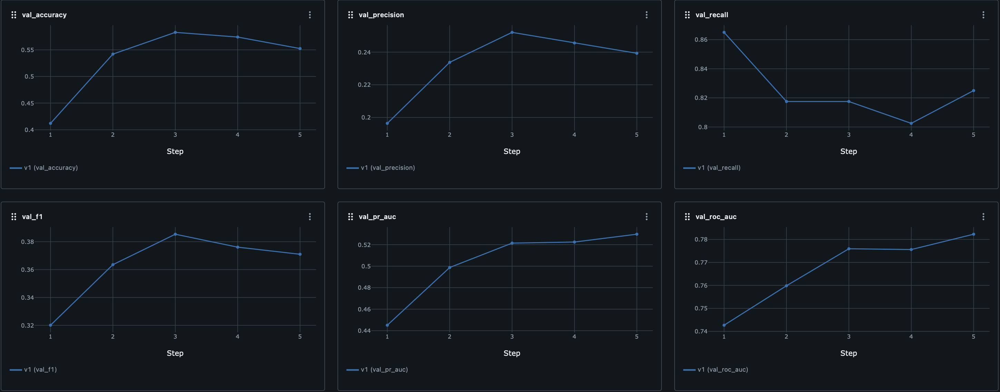
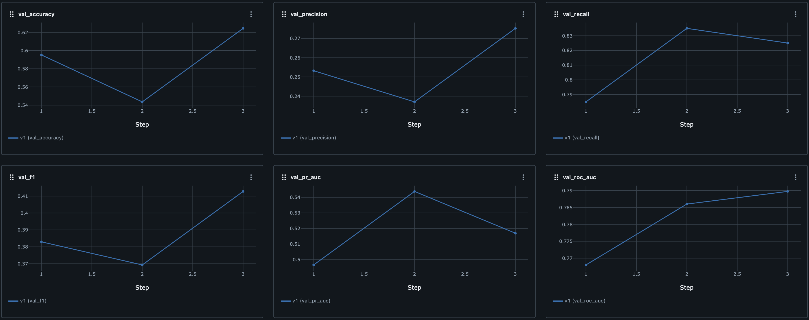
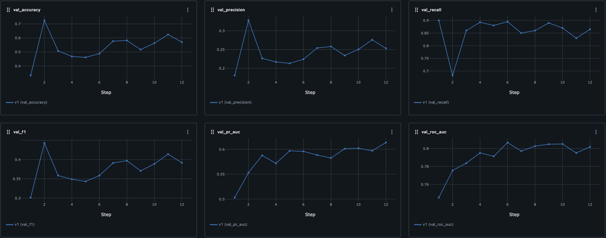
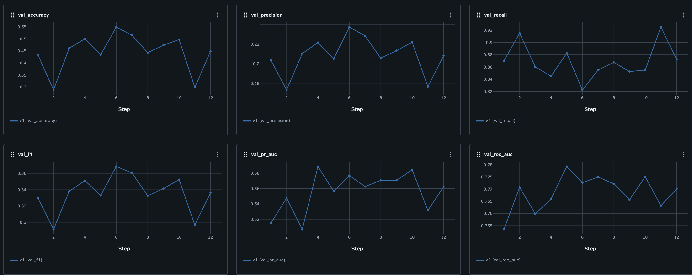
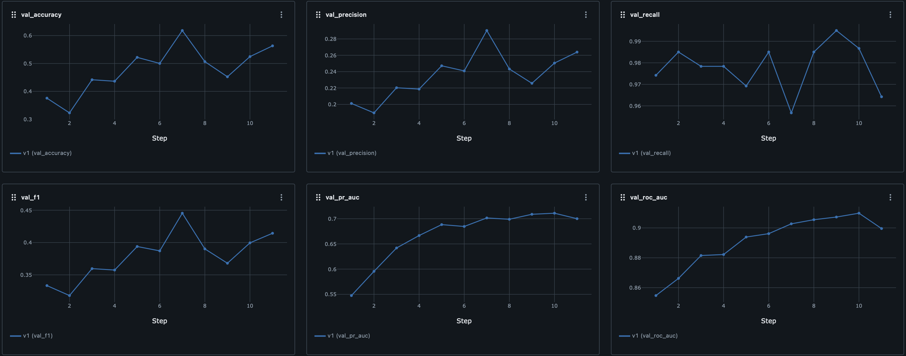
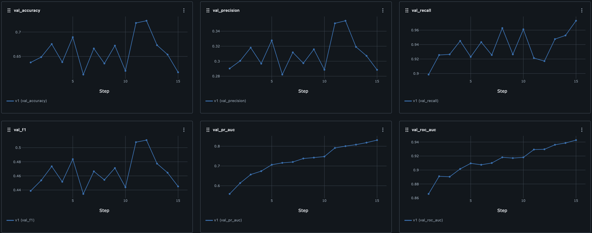

Hey! First of all, I want to say thank you for such an interesting and non-trivial test assignment. I was truly enthusiastic about reading articles on proteins and their structure. One of the metrics by which a man can be measured is the scale of the problem he is solving. Contributing to cancer drug research is an incredibly inspiring challenge — one that I would love to dedicate a significant part of the time that has been given to me to.

- **A precise description of your method and how it extends ESM2.**
Fine-tuned ESM2 and ESM-MSA-1b models; with tokenized sequence and MSA as inputs; trained on three tasks - contact map prediction, distance map prediction (bins prediction in classification manner), angle prediction (bins prediction in classification manner); with transformer-based CrossFusion module for task-specific embeddings fusion.

- **Data pre- and post-processing steps.**
1. PDB files converts to H5 dataset that includes sequence, msa, contact map, distance map, angle map.
2. The maximum length of sequence and MSA is limited by the max_length argument in the training configuration file.
3. The maximum distance in distance map is limited by the max_distance argument in the training configuration file.
4. Number of MSA rows is set by the num_msa_rows argument in the training configuration file.
5. In train mode, either truncation or random cropping is applied to process long sequences.
6. In validation mode, either truncation or sliding window is applied to process long sequences.
7. Padding and special tokens (CLS, EOS, UNK) are applied to process short sequences.

- **Hyperparameters and other relevant details of the ML setup.**
    ```yaml
    train_data_path: `path to training HDF5 dataset`
    test_data_path: `path to validation HDF5 dataset`

    dataset:
        max_length: `maximum protein sequence length used for cropping/truncation/padding`
        max_distance: `maximum distance value for generating distance bins`
        sliding_window_step: `step size when applying a sliding window on long sequences during validation`
        train_mode: `cropping strategy during training; "random_crop" selects a random part, "truncate_seq" always takes the first part`
        val_mode: `cropping strategy during validation; "sliding_window" uses overlapping windows, "truncate_seq" uses the first part`
        use_msa: `whether to use multiple sequence alignment (msa) data for training`
        num_msa_rows: `number of MSA sequences to use per protein`
        num_angle_bins: `number of discrete bins for angle classification`
        train_batch_size: `number of training samples per batch`
        val_batch_size: `number of validation samples per batch`

    model:
        esm2_name: `identifier for pre-trained esm2 model used for sequence embeddings`
        esm_msa_name: `identifier for pre-trained msa model used for msa embeddings`
        main_task: `primary prediction task; "contact" uses contact head predictions, "distance" uses distance head predictions (converted to binary contact map)`
        use_contact: `whether to train on contact map prediction task`
        use_distance: `whether to train on distance map prediction task`
        use_angle: `whether to train on angle map prediction task`
        num_layers_to_freeze_esm2: `number of initial layers to freeze in esm2 model`
        num_layers_to_freeze_msa: `number of initial layers to freeze in msa model`
        fusion_dim: `size of embedding space for fused features`
        fusion_num_layers: `number of layer in fusion module`
        fusion_num_heads: `number of heads in fusion module`

    train:
        seed: `random seed for reproducibility`
        num_epochs: `number of training epochs`
        contact_loss_type: `loss type for contact prediction ("bce" or "focal")`
        bce_contact_class_weights: `weights for negative and positive classes in bce loss (e.g., [1.0, 30.0])`
        learning_rate: `optimizer’s learning rate`
        cosine_annealing_warm_restart_t_0: `cosine annealing scheduler t_0 parameter`
        cosine_annealing_warm_restart_t_mult: `cosine annealing scheduler t_mult parameter`
        cosine_annealing_warm_restart_eta_min: `cosine annealing scheduler eta_min parameter`
        focal_gamma: `focal loss annealing scheduler gamma parameter`
        focal_alpha: `focal loss annealing scheduler alpha parameter`
        contact_loss_weight: `weighting factor for the contribution of contact loss to the total loss`
        distance_loss_weight: `weighting factor for the contribution of distance loss to the total loss`
        angle_loss_weight: `weighting factor for the contribution of angle loss to the total loss`
        use_scheduler: `weither to use learning rate scheduler`
        overfit_one_batch: `weither to use one batch overfitting`

    checkpoints:
        checkpoint_path_to_load: `path to checkpoint that you wanna load`
        checkpoints_dir_path: `path to checkpoints folder`
        checkpoints_metric: `metric used to determine best checkpoint`
        maximize_metric: `indicates if higher values of the checkpoint metric are better`
        save_best_k_checkpoints: `maximum number of top checkpoints to retain`

    mlflow:
        enabled: `enable mlflow logging`
        tracking_uri: `mlflow tracking server uri (e.g., "http://localhost:5000")`
        experiment_name: "mlflow experiment name"
        run_name: "mlflow run name"
    ```

- **Analysis of the results, including performance metrics and insights.**
Because of the time constraints, I allowed myself to train on short sequences and **leave the models underfitted**, focusing on performance during the early epochs. Please take this factor into account.

Due to class imbalance and the specifics of the task, ROC AUC seemed like a good choice as the primary metric. I will also include Precision, Recall, F1, and PR AUC. Should keep in mind that **I have not tuned the threshold**.

I conducted 6 experiments:

1. esm2_t6_8M_UR50D as pretrained model, sequence as input, contact map prediction as main task, bce-loss as main loss.


2. esm2_t6_8M_UR50D and esm_msa1b_t12_100M_UR50S as pretrained models, sequence and msa as inputs, contact map prediction as main task, bce-loss as main loss.


3. esm2_t6_8M_UR50D and esm_msa1b_t12_100M_UR50S as pretrained models, sequence and msa as inputs, contact map prediction as main task, distance map and angle map prediction as auxiliary tasks, bce-loss as main loss, mse-loss and mse-loss as auxiliary losses.


4. esm2_t6_8M_UR50D and esm_msa1b_t12_100M_UR50S as pretrained models, sequence and msa as inputs, contact map prediction as main task, distance map and angle map prediction as auxiliary tasks, bce-loss as main loss, smoothed-l1-loss and cosine-loss as auxiliary losses.


5. esm2_t6_8M_UR50D and esm_msa1b_t12_100M_UR50S as pretrained models, sequence and msa as inputs, contact map prediction as main task, distance map and angle map prediction as auxiliary tasks, bce-loss as main loss, crossentropy-loss and crossentropy-loss as auxiliary losses.


6. esm2_t12_35M_UR50D and esm_msa1b_t12_100M_UR50S as pretrained models, sequence and msa as inputs, contact map prediction as main task, distance map and angle map prediction as auxiliary tasks, bce-loss as main loss, crossentropy-loss and crossentropy-loss as auxiliary losses.



- **Breakdown of the time (in hours) spent on each aspect of the task.**
1. Research (4-5 hours).
2. Dataset Preparation (3-4 hours).
3. Training Pipeline (8-9 hours).
4. Experiments (70-80 hours).
